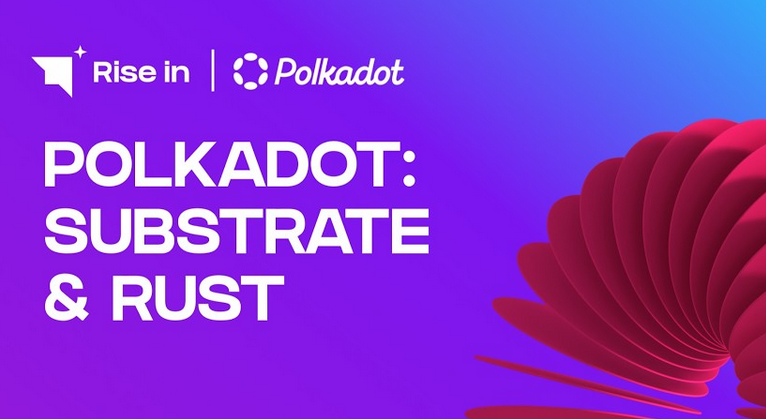

# Polkadot: Substrate & Rust

## 📺 [Watch all videos](https://www.youtube.com/playlist?list=PLZFxkoo9XOjtr_Ce_ffPbQeovFQGWXiO4)

1. [Polkadot Use Cases: Revolutionizing Blockchain Applications](https://github.com/Laugharne/polkadot_substrate_rust/blob/main/chapters/1%20-%20Polkadot%20Use%20Cases%3A%20Revolutionizing%20Blockchain%20Applications.md)
2. [How Does Polkadot Solve the Blockchain Trilemma](https://github.com/Laugharne/polkadot_substrate_rust/blob/main/chapters/2%20-%20How%20Does%20Polkadot%20Solve%20the%20Blockchain%20Trilemma.md)
3. [Polkadot's Architecture and Shared Security Model](https://github.com/Laugharne/polkadot_substrate_rust/blob/main/chapters/3%20-%20Polkadot's%20Architecture%20and%20Shared%20Security%20Model.md)
4. [Getting Started with Polkadot Development: Substrate Explained](https://github.com/Laugharne/polkadot_substrate_rust/blob/main/chapters/4%20-%20Getting%20Started%20with%20Polkadot%20Development%3A%20Substrate%20Explained.md)
5. [Learn Substrate: Build Your Own Blockchain Today](https://github.com/Laugharne/polkadot_substrate_rust/blob/main/chapters/5%20-%20Learn%20Substrate%3A%20Build%20Your%20Own%20Blockchain%20Today.md)
6. [How Substrate Powers Blockchain Interoperability](https://github.com/Laugharne/polkadot_substrate_rust/blob/main/chapters/6%20-%20How%20Substrate%20Powers%20Blockchain%20Interoperability.md)
7. [Understanding Substrate Nodes: Full, Archive & Light Clients](https://github.com/Laugharne/polkadot_substrate_rust/blob/main/chapters/7%20-%20Understanding%20Substrate%20Nodes%3A%20Full%2C%20Archive%20%26%20Light%20Clients%20.md)
8. [From State Transitions to XCM: Inside Substrate](https://github.com/Laugharne/polkadot_substrate_rust/blob/main/chapters/8%20-%20From%20State%20Transitions%20to%20XCM%3A%20Inside%20Substrate.md)
9. [Complete Guide to Installing Rust for Substrate](https://github.com/Laugharne/polkadot_substrate_rust/blob/main/chapters/9%20-%20Complete%20Guide%20to%20Installing%20Rust%20for%20Substrate.md)
10. [How to Set Up a Substrate Node and Front-End Template](https://github.com/Laugharne/polkadot_substrate_rust/blob/main/chapters/10%20-%20How%20to%20Set%20Up%20a%20Substrate%20Node%20and%20Front-End%20Template.md)
11. How to Simulate a Substrate Node Network Locally
12. Substrate Nodes: Setting Up a Secure Private Network
13. How to Authorize Nodes in Substrate: Step-by-Step Guide
14. How to Monitor Substrate Nodes: A Complete Guide
15. Forkless Runtime Upgrades with Substrate: A Step-by-Step Guide
16. Advanced Substrate Development: Custom Pallet Tutorial
17. Create Blockchain Apps with Substrate Smart Contracts
18. Relay Chain Setup for Blockchain Developers Substrate Guide

